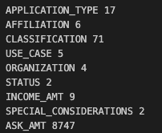
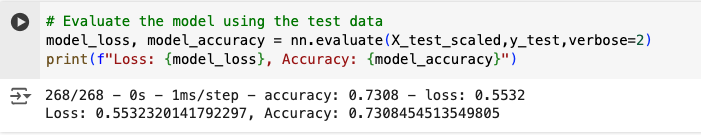
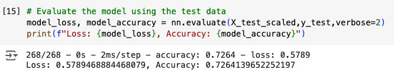
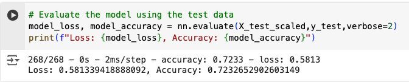
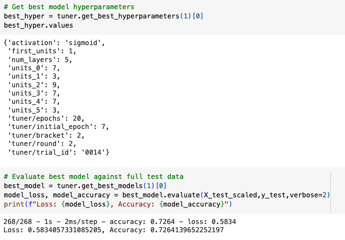
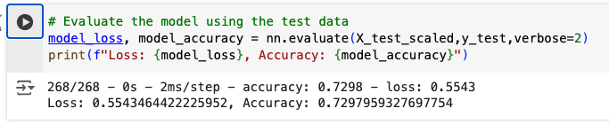

## deep-learning-challenge

Coding assistance for this challenge came from Google Collab, Instructor Activity 21.2.04 AutoOptimization, and Instructor Activity 21.1.02 Work Through NN Solution.

## Neural Network Report

Overview of the analysis: The purpose of this analysis is to aid the nonprofit foundation Alphabet Soup in selecting funding applicants who have the best chance of success. Using machine learning and neural networks, I took information from Alphabet Soup of 34,000+ organizations that they have funded in the past to build a model to predict future applicant success.

Results: Using bulleted lists and images to support your answers, address the following questions:

# Data Preprocessing

What variable(s) are the target(s) for your model?
* The variable target for this model is the IS_SUCCESSFUL column of the application_df dataframe.

What variable(s) are the features for your model?
* The features for this model are the following columns listed below. Since several of these features are originally listed as strings in the dataset, I used get_dummies to convert them into floats.
* features based on column name
* 
* features after get_dummies
* 

What variable(s) should be removed from the input data because they are neither targets nor features?
* "EIN" and "NAME" were both removed from the input data.

# Compiling, Training, and Evaluating the Model

How many neurons, layers, and activation functions did you select for your neural network model, and why?
1. Neurons:
 * First hidden layer: 9 neurons
 * Second hidden layer: 1 neuron
 * Third hidden layer: 7 neurons
 * Fourth hidden layer: 1 neuron
 * Fifth hidden layer: 9 neurons

2. Layers:
* total hidden layers: 4 (plus one input and one output layer, so there are 6 layers total)

3. Activation:
* hidden layers: tanh
* output layers: sigmoid

4. Why these functions?
* These are the functions that Keras Turner selected after trialing 60 different parameters which gave the highest accuracy of 73.27%. I was able to get an accuracy of 72.92% with 8 neurons in the first hidden layer, 5 neurons in the second hidden layer, and 1 neuron in the output later using relu for the hidden layer activation function and sigmoid for the output layer activation function. By using Keras Turner, I was able to trial several different combinations without having to manually change them myself.

Were you able to achieve the target model performance?
* While I was able to improve the model's performance, unfortunately, I did not get to the 75% accuracy.

What steps did you take in your attempts to increase model performance?
* I tried several different strategies for increasing model performance.
* optimization 1: increasing epochs to 150, setting hidden_nodes_layer1 to 8 and setting hidden_nodes_layer2 to 5.
    * results: 
* optimization 2: dropped SPECIAL_CONSIDERATIONS, added 3rd hidden nodes layer and set layers 1, 2, and 3 to 80, 30, and 10 respectively, set epochs to 150.
    * results: 
* optimization 3: added SPECIAL_CONSIDERATIONS back and removed the third hidden layer
    * results: 
* optimization 4: finding best model hyperparameters using keras_tuner
    * results: 
* optimization 5: setting epochs to 100, setting hidden_nodes_layer1 to 8 and setting hidden_nodes_layer2 to 5.
    * results: 

Summary: Overall, I found that the model was slightly more successful with a lower number of epochs and a lower number of neurons with only 2 hidden layers. As you can see in the code, using keras_tuner to find the best model hyperparameters is another effective way to solve the same problem. This allows the data analyst to efficiently test multiple variations to potentially find a higher accuracy.